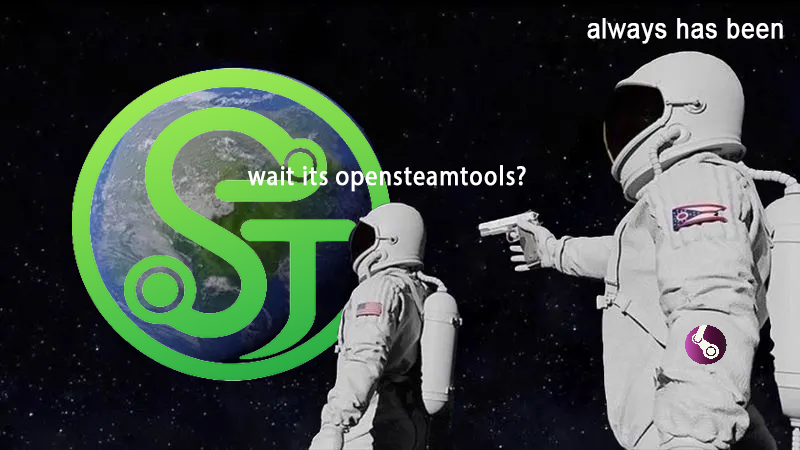

<div align="center">
  

  <h1>AmethystTool - a fork of OpenSteamTools!</h1>

  <p>
    <strong>Open-Source Steam Unlock Tool</strong>
  </p>

  <p>
    
    
    
    <a href="https://deepwiki.com/OpenSteam001/OpenSteamTool">
      
    </a>
  </p>

  <p>
    <a href="README.md">
      
      English
    </a>
    &nbsp;|&nbsp;
    <a href="README_ES.md">
      
      Español
    </a>
    &nbsp;|&nbsp;
    <a href="README_ZH.md">
      
      中文
    </a>
  </p>
</div>

## About this fork (Amethyst)

AmethystTool is a privacy-hardened fork of OpenSteamTools. Behavioural differences from upstream:

- **Self-update is disabled and compiled out.** Upstream downloaded a replacement DLL on startup and overwrote itself in place, verifying integrity only against a hash served by the same channel — so whoever controlled a mirror controlled the code that ran on your machine (a remote-code-execution vector), and the fork stayed tethered to upstream infrastructure. The Amethyst build removes this path entirely; the `[update] enabled` key is still parsed for config compatibility but has no effect. (Rebuild with `OST_ENABLE_AUTOUPDATE` defined to restore the old behaviour.)
- **Telemetry is off by default.** The stats API (`https://stats.opensteamtool.com/{appid}`, which reveals which apps you launch) is opt-in: `[stats] enable_api = false` unless you turn it on.
- **Resilient local cache.** [Pattern lookup](#steam-version-compatibility) still consults the upstream tracker on each launch, but a local cache under `<Steam>\amethysttool\` keeps the tool working when the remote is unreachable.
- **Renamed surface.** The DLL is `AmethystTool.dll` and the config file is `amethysttool.toml`. Settings from a pre-rename `opensteamtool.toml` are migrated automatically on first launch — see [Config migration](#config-migration).

> **Test in an isolated environment before using on your main account.** Injecting into Steam carries account risk that is entirely yours — see [TESTING.md](TESTING.md).

## Feature

### Core Unlocks
- Unlock an unlimited number of unowned games.
- Unlock all DLCs for unowned games.
- Support auto load depot decryption keys from Lua config.
- Support auto manifest download via `opensteamtool` / `steamrun` / `wudrm` upstream APIs (default is `opensteamtool`), or a custom Lua endpoint (see [Manifest via Lua](#manifest-via-lua)).
- Support downloading protected games or DLCs that require an access token.
- Support binding manifest to prevent specific games from being updated.

### Hot Reload
- Adding, modifying, deleting, or overwriting `.lua` files in any watched directory automatically triggers a reload. No restart, no offline/online toggle needed.

### Injection
- Add optional game-process DLL injection through one or more `[[inject]]` entries in `amethysttool.toml`.
- Each entry sets a `path` (a bare name resolves next to `steam.exe`; an absolute path is used as-is) and optional conditions — `when_cmdline` (substring required in the launch command), `when_appids` (restrict to specific appids), and `all_games` (`true` = every game, `false` = only Lua-added games). A DLL injects when *every* condition it sets matches; multiple entries may target the same game and each DLL injects at most once.

### Family Sharing and Remote Play
- Bypass Steam Family Sharing restrictions for games that have been added to the library with `addappid` in Lua. All accounts in the Steam Family that participate in sharing must use AmethystTool for this to work.

### Compatible with games protected by Denuvo and SteamStub
- SteamStub-only games do not require configuring `AppTicket`. AmethystTool can reuse Steam's local ConfigStore ticket and forge the requested AppId through a SteamDRMP off-by-four ticket parsing vulnerability, without injecting into the game process.

### Third-party product keys ("Updating product key")
- For titles that carry a Steam-issued third-party retail key (Ubisoft Connect, Rockstar, etc.), AmethystTool answers the client's legacy key request locally, so the "Updating product key" step completes for added games instead of failing. Supply a real key with `setlegacycdkey(appid, "KEY")`; when none is configured a deterministic synthetic key is generated. A synthetic key satisfies Steam's local step only — titles that validate the key online still require a real one.
- Denuvo-protected games still require explicit ticket data. AmethystTool stores `AppTicket` and `ETicket` through the platform credential store.
- Use `setAppTicket(appid, "hex")` and `setETicket(appid, "hex")` in Lua config to write these values to the platform credential store automatically.
- Denuvo verification has a 30-minute validity window. After this window expires, authorization may fail with Denuvo error code `88500005`; refresh the ticket data before retrying.
- AppTicket priority: explicit tickets have the highest priority, including tickets configured by `setAppTicket` and existing cached `AppTicket` credential values. If no explicit AppTicket is available, AmethystTool falls back to the forged local ConfigStore ticket path.
- SteamID priority: read cached `SteamID` first; if missing, parse from explicit `AppTicket`. On Windows, the credential store backend currently uses `HKCU\Software\Valve\Steam\Apps\<AppId>`. The Linux backend is not implemented yet.

#### Extracting tickets with `extract_tickets`

The `extract_tickets` tool dumps the `AppTicket` and `ETicket` hex strings you need for `setAppTicket` / `setETicket`. Run it on a machine where Steam is running and logged into an account that **owns** the target game.

1. Build the tools (see [Build](#build)); the binary lands in `build/tools/Release/extract_tickets.exe`.
2. Run it with the target AppId (or run it with no argument and type the AppId when prompted):
   ```powershell
   extract_tickets.exe 1361510
   ```
3. It reads the Steam install path from the registry, loads `steamclient64.dll`, and writes everything into an `<appid>/` folder next to the executable:
   - `appticket.bin` — raw app ownership ticket (binary)
   - `eticket.bin` — raw encrypted app ticket (binary)
   - `tickets.txt` — plain-text summary with the hex strings:
     ```
     appid:1361510
     appticket(184 bytes):14000000...
     eticket(143 bytes):...
     ```
   A ticket that could not be obtained is reported as `appticket:null` / `eticket:null`.
4. Paste the hex strings from `tickets.txt` into your Lua config:
   ```lua
   setAppTicket(1361510, "14000000...")
   setETicket(1361510, "...")
   ```

> **Note:** Tickets are only valid when extracted from an account that **genuinely owns** the game.

### Stats and Achievements
- Enable stats and achievements for unowned games.
- Uses `setStat(appid, "steamid")` to configure which SteamID's achievement data to pull.
- If no `setStat` is configured for an app, AmethystTool queries `https://stats.opensteamtool.com/{appid}` when `[stats] enable_api = true`. **Off by default in this fork** (opt-in — see [About this fork](#about-this-fork-amethyst)).
- Priority: `setStat` > stats API when enabled and valid > hardcoded preset SteamID `76561198028121353`.

### Online Fix
- Add `-onlinefix` to the Steam launch parameters to enable 480-based online play in games that use lobby matchmaking. The current limitation is that only one such game can run at a time.To revert, simply remove -onlinefix from the launch parameters — online play returns to normal on the next launch.

## Future
- Steam Cloud synchronization support.(This is a huge project)

## Usage
1. Run `build.bat` from the project root to build the project.
2. Copy generated `dwmapi.dll`, `xinput1_4.dll` and `AmethystTool.dll` to the Steam root directory.
3. Create Lua directory (for example `C:\steam\config\lua`) and place Lua scripts there. The DLL will automatically load and execute them.
4. Lua example:
```lua
addappid(1361510) -- unlock game with appid 1361510

addappid(1361511, 0,"5954562e7f5260400040a818bc29b60b335bb690066ff767e20d145a3b6b4af0") -- unlock game with appid 1361511 depotKey is "5954562e7f5260400040a818bc29b60b335bb690066ff767e20d145a3b6b4af0" 

addtoken(1361510,"2764735786934684318") -- add access token ("2764735786934684318") for game with appid 1361510 

setManifestid(1361511,"5656605350306673283") -- pin depotid:1361511 manifest_gid:5656605350306673283, size defaults to 0
setManifestid(1361511,"5656605350306673283", 12345678) -- same but with explicit size

setAppTicket(1361510,"0100000000000000...") -- write AppTicket to the credential store; on Windows: HKCU\Software\Valve\Steam\Apps\1361510\AppTicket

setETicket(1361510,"0100000000000000...") -- write ETicket to the credential store; on Windows: HKCU\Software\Valve\Steam\Apps\1361510\ETicket

setStat(1361510, "76561197960287930") -- use the specified SteamID's achievement data for appid 1361510
-- If not configured, the stats API is used when enabled; otherwise default SteamID 76561198028121353 is used.

setlegacycdkey(1361510, "ABCD-EFGH-JKMN-PQRS") -- serve this third-party retail CD key at the "Updating product key" step
-- If not configured, a deterministic synthetic key is generated per app+account (satisfies Steam's local step only).
```

All function names are **case-insensitive**. `setAppTicket`, `setappticket`, `SetAppticket`, `SETAPPTICKET` etc. are all equivalent. The same applies to every registered function (`addAppId`, `AddToken`, `SETManifestid`, etc.).

### Configuration (optional)

Rename `amethysttool.example.toml` to `amethysttool.toml` and place it in the Steam root directory (next to `steam.exe`).
If no config file is found, built-in defaults are used — no auto-creation.
The file is watched while Steam is running; valid changes are hot-reloaded without restarting Steam.

```toml
[log]
# Debug build only.  Level: trace, debug, info, warn, error
level = "info"

[manifest]
# Upstream API for depot manifest request codes.  Options: "opensteamtool", "steamrun", "wudrm"
url = "opensteamtool"

# HTTP timeouts for manifest requests (milliseconds)
timeout_resolve_ms = 5000
timeout_connect_ms = 5000
timeout_send_ms    = 10000
timeout_recv_ms    = 10000

[stats]
# Query https://stats.opensteamtool.com/{appid} when no Lua setStat override exists.
# Priority: setStat > stats API > hardcoded preset SteamID.
# Off by default in this fork (opt-in: enabling it reveals which apps you launch).
enable_api = false

# Additional Lua config directories (optional).
# Files are loaded after the default <Steam>/config/stplug-in folder.
# The default folder is always loaded last so user files take priority.
[lua]
paths = []

# Optional DLL injection into game processes. Each [[inject]] entry is loaded
# when every condition it sets matches the launch.
# [[inject]]
# path = "AmethystToolHook.dll"       # bare name resolves next to steam.exe; absolute path used as-is
# when_cmdline = "-my_special_hook"   # optional: require this substring in the launch command (default: any)
# when_appids = [1361510]             # optional: restrict to these appids (default: any)
# all_games = false                   # optional: true injects into every game, false only into Lua-added games (default: false)

# Optional metadata mirror. See "Steam version compatibility" below.
[remote]
# url_template = "https://your.server/{channel}/{component}/{sha256}.toml"
```

### Config migration

If you are updating from the upstream OpenSteamTools (which read `opensteamtool.toml`), your settings are carried over automatically. On first launch, if there is **no** `amethysttool.toml` next to `steam.exe` but an `opensteamtool.toml` exists there, AmethystTool copies it to `amethysttool.toml` and logs `Migrated config from opensteamtool.toml to amethysttool.toml`.

- The copy runs at most once and **never overwrites** an existing `amethysttool.toml` — a config you already created under the new name always wins.
- The old `opensteamtool.toml` is **left in place** (copied, not moved), so rolling back to an older build still finds its config.
- Only the file name changes; the TOML keys and values are untouched.

If neither file exists, built-in defaults are used (no file is created).

### Manifest via Lua

Two manifest code functions are supported:

#### `fetch_manifest_code(gid)`

Basic function that receives only the manifest GID.

#### `fetch_manifest_code_ex(app_id, depot_id, gid)` *(recommended)*

Extended function that receives `app_id`, `depot_id`, and `gid`. Allows constructing API endpoints that require app identification.

The C++ runtime provides two Lua helpers:

| Function | Signature | Returns |
|----------|-----------|---------|
| `http_get`  | `http_get(url [, headers])`       | `body, status_code` |
| `http_post` | `http_post(url, body [, headers])` | `body, status_code` |

`headers` is an optional table: `{["Key"]="Value", ...}`.

### Steam version compatibility

AmethystTool no longer ships byte-pattern signatures inside the DLL. Instead, on each launch it computes the SHA-256 of `steamclient64.dll` and `steamui.dll` on disk and looks up a matching pattern file from the upstream tracker at [`OpenSteam001/steam-monitor`](https://github.com/OpenSteam001/steam-monitor) (`pattern` branch).

Lookup order (every launch):

1. **GitHub raw** — `https://raw.githubusercontent.com/OpenSteam001/steam-monitor/pattern/...`. Canonical source.
2. **jsDelivr CDN** — automatic fallback if GitHub raw is unreachable (connection refused / timeout / 5xx). No configuration required. Useful in regions where `raw.githubusercontent.com` is blocked but jsDelivr is reachable (e.g. mainland China).
3. **Local cache** — `<Steam>\amethysttool\pattern\<subdir>\<sha256>.toml`. Used **only** when remote is unreachable. The cache is overwritten after every successful remote fetch.

Remote is consulted on every launch so users automatically pick up upstream re-publications (e.g. the bot adding a new signature, or fixing an existing one) without having to clear any cache.

If a step returns **HTTP 404** the mirror loop stops immediately — all mirrors serve the same content, so a 404 means the upstream bot has not yet published a TOML for this Steam build. The code then falls back to the local cache if one exists; otherwise a one-shot popup appears with the unmatched DLL name, its SHA-256, the expected cache path, and the upstream URL. Only the hooks tied to that DLL are disabled — the rest of AmethystTool keeps working.

You can also drop a pattern TOML into the cache directory manually if you know the layout for a given build; the file name must be `<sha256>.toml`. The cache fallback will pick it up the next time remote is unreachable.

> A short outbound HTTPS request is performed at every launch (one per DLL: `steamclient64.dll`, `steamui.dll`). The downloaded bodies are tiny (~10 KB each) and the work runs on a worker thread, so it never blocks Steam's loader.

#### Using a different mirror

For most users, the built-in **GitHub -> jsDelivr** fallback is enough. To use a private mirror or intranet server, configure a full URL template. A custom mirror replaces the built-in remote sources; local cache fallback remains available.

The template must include `{channel}`, `{component}`, and `{sha256}`. Channels currently used are `pattern` and `ipc`.

```toml
[remote]
url_template = "https://your.server/{channel}/{component}/{sha256}.toml"
# url_template = "https://fast.jsdelivr.net/gh/OpenSteam001/steam-monitor@{channel}/{component}/{sha256}.toml"
```

Your server must serve, for each request, a TOML document keyed by function name, where each entry has an optional `rva` (hex string, offset from module base) and/or `sig` (IDA-style byte pattern, `??` for wildcard bytes) — `rva` is tried first, `sig` is the fallback if the RVA doesn't resolve or isn't present:

```toml
[BBuildAndAsyncSendFrame]
rva = "0x1A2B30"
sig = "48 89 5C 24 ?? 57 48 83 EC 20"

[BuildDepotDependency]
sig = "40 53 48 83 EC ?? 48 8B D9"
```

A 404 for a given `{sha256}` is treated as "no pattern published yet for this Steam build" (not an error) — see [Steam version compatibility](#steam-version-compatibility) above for the full lookup/fallback order.

### Debug logging

Debug builds write per-module log files under `<Steam>/amethysttool/`:

| File | Source | Content |
|------|--------|---------|
| `main.log`          | General | Init, config loading, Lua parsing, utilities |
| `ipc.log`           | `LOG_IPC_*` | IPC commands, InterfaceCall dispatch, spoofing |
| `netpacket.log`     | `LOG_NETPACKET_*` | Network packet send/recv, eMsg dispatch |
| `manifest.log`      | `LOG_MANIFEST_*` | Manifest download, `fetch_manifest_code`, manifest binding |
| `decryptionkey.log` | `LOG_DECRYPTIONKEY_*` | Depot decryption key injection |
| `keyvalue.log`      | `LOG_KEYVALUE_*` | KeyValues patching (manifest binding) |
| `misc.log`          | `LOG_MISC_*` | Engine pointer capture, AppId hints |
| `achievement.log`   | `LOG_ACHIEVEMENT_*` | UserStats requests/responses, steamid spoofing |
| `pics.log`          | `LOG_PICS_*` | PICS access token injection |
| `package.log`       | `LOG_PACKAGE_*` | Package injection, FileWatcher events |
| `onlinefix.log`     | `LOG_ONLINEFIX_*` | Online fix (480 AppId spoofing) |
| `richpresence.log`  | `LOG_RICHPRESENCE_*` | Rich Presence packet construction and injection |
| `steamui.log`       | `LOG_STEAMUI_*` | SteamUI hook diagnostics |
| `pipe.log`          | `LOG_PIPE_*` | Pipe handshakes, process inspection, Denuvo authorization, library injection |
| `platform.log`      | `LOG_PLATFORM_*` | Platform helper diagnostics, including remote-process operations |

The log level is controlled by `[log] level` in `amethysttool.toml`.

## Antivirus and SmartScreen

AmethystTool works by loading into Steam and installing in-process hooks (via Microsoft Detours). These are exactly the techniques antivirus heuristics look for, so **an unsigned build will very likely be flagged or quarantined** — this is a false positive inherent to the technique, not evidence of malware. Kaspersky, Defender, and others have been observed quarantining the freshly built DLLs.

### If your antivirus removes or blocks the DLLs

Exclude the three specific files, not the whole Steam folder — that keeps on-access scanning active for everything else Valve puts there:

- `<Steam>\AmethystTool.dll`
- `<Steam>\dwmapi.dll`
- `<Steam>\xinput1_4.dll`

Most antivirus exclusion lists accept individual file paths (not just folders); use the file-path form if your product offers it. If a build was already quarantined, restore it from quarantine and then add the exclusions, or rebuild after excluding the three paths. A whole-folder exclusion for the Steam root also works and is simpler to keep correct across rebuilds, but it is a strictly larger trust grant than the tool needs — prefer the file-level form when your AV supports it.

Windows SmartScreen may warn on first run because the binaries are unsigned — this is expected for a self-built, unsigned tool (see "Code signing" below for what actually removes that warning).

### Code signing

Signing the DLLs does not change what the antivirus heuristic is reacting to (in-process hooking still looks the same), but it does let you attribute the binary to yourself and, with the right certificate type, can reduce SmartScreen friction over time.

- **Self-signed certificate (personal use only)** — proves the DLL wasn't tampered with *after your own build*, but is not trusted by anyone else's machine unless they import your certificate. Useful mainly to detect a corrupted or replaced local build.
  ```powershell
  New-SelfSignedCertificate -Type CodeSigning -Subject "CN=YourName" -CertStoreLocation Cert:\CurrentUser\My
  signtool sign /sha1 <thumbprint> /fd SHA256 /t http://timestamp.digicert.com AmethystTool.dll dwmapi.dll xinput1_4.dll
  ```
  `signtool` ships with the Windows SDK; the certificate thumbprint is printed by the `New-SelfSignedCertificate` command above.
- **Public code-signing certificate** — trusted by other machines out of the box, from a CA such as DigiCert, Sectigo, or SSL.com. This costs money annually and requires identity verification; it is a decision for whoever distributes builds to other people, not something this project can do on your behalf. **A standard (OV) certificate does *not* immediately clear SmartScreen** — Microsoft's SmartScreen reputation is earned over time/download volume regardless of signature; only an **EV (Extended Validation)** certificate grants instant reputation, and EV certs are the more expensive tier requiring hardware-token/HSM key storage.
- Either way, signing an injection/hooking tool does **not** guarantee an antivirus stops flagging it — heuristic engines key off *behavior* (WriteProcessMemory into another process, IAT/inline hooks), and a valid signature is one signal among many, not an override.

### Reporting a false positive

If you want the specific vendor to stop flagging your build, submit it directly — see [AV_WHITELIST.md](AV_WHITELIST.md) for the submission checklist and links (Microsoft Defender, Kaspersky, and others).

### If you'd rather not add exclusions at all

Only exclude files you built or trust. If you would rather not weaken your protection, run the tool in an isolated environment instead — see [TESTING.md](TESTING.md). You can audit exactly what the tool sends over the network in the [Steam version compatibility](#steam-version-compatibility) and [About this fork](#about-this-fork-amethyst) sections.

## Build

### Requirements
- Windows 10/11
- Visual Studio 2022 (Build Tools or full IDE) with the "Desktop development with C++" workload — this provides the MSVC x64 toolchain and, normally, the bundled CMake/Ninja component
- CMake 3.25+ and Ninja, if not already provided by the VS component above

### Runtime requirements
- Outbound HTTPS access to `raw.githubusercontent.com` on first launch after a Steam update (see [Steam version compatibility](#steam-version-compatibility)). Cached afterwards.

### Quick build
```powershell
.\build.ps1
```
`build.ps1` automates the full pipeline: it finds your Visual Studio 2022 install and `vcvars64.bat` (checking `vswhere`, then the standard BuildTools/Community/Professional/Enterprise paths), loads the MSVC compiler environment, locates `cmake`/`ninja` (VS-bundled or standalone) even when neither is on `PATH`, configures the `ninja-multi` preset, builds **and tests** both Release and Debug, then verifies the produced DLL's ABI (`TokeerUri` at ordinal 1) and static-CRT linkage (no `vcruntime140`/`msvcp140`/`ucrtbase` dependency). It never edits source and is safe to re-run: without `-Clean` it's a normal incremental build.

```powershell
.\build.ps1 -Clean
```
Deletes the object directories for this project's own targets (`AmethystTool`, `OpenSteamTool`, `OSTPlatform`, `dwmapi`, `xinput1_4`, `AmethystToolTests`) before rebuilding — use this to get an authoritative warning count. Third-party dependencies (googletest, spdlog, protobuf, tomlplusplus, Detours, Lua, and the `.deps/` source cache) are left untouched, so they aren't rebuilt from source every time.

If your toolchain lives somewhere nonstandard, set `$env:BST_VCVARS64` to the full path of your `vcvars64.bat` before running the script.

Prefer the manual route? `build.bat` (from a Developer Command Prompt, or with `cmake`/`ninja` already on `PATH`) still works and does the same configure+build.

### Output
- Debug: `build/Debug/AmethystTool.dll`, `build/Debug/dwmapi.dll`, `build/Debug/xinput1_4.dll`
- Release: `build/Release/AmethystTool.dll`, `build/Release/dwmapi.dll`, `build/Release/xinput1_4.dll`

### Packaging a release
```powershell
.\release.ps1 -Version 1.2.0
```
Builds (via `build.ps1 -Clean`), then assembles `release/AmethystTool-v<Version>/` with the three DLLs, `amethysttool.example.toml` (renamed to `amethysttool.toml`), `README.md`, `TESTING.md`, `AV_WHITELIST.md`, and a generated `INSTALL.txt`; zips it to `release/AmethystTool-v<Version>.zip`; writes `release/RELEASE_NOTES-v<Version>.md` from the commit log since the previous tag; and creates a **local** annotated tag `v<Version>`. It never commits, pushes, or touches GitHub — the final output tells you the `git push` / `gh release create` commands to run yourself.

Flags:
- `-SkipBuild` — package whatever is already in `build\Release` instead of rebuilding.
- `-SkipTests` — only meaningful with `-SkipBuild`: skip the independent `ctest` re-verification pass and package an unverified build.

Re-running with the same `-Version` is idempotent: the package directory and zip are regenerated, and if the tag already exists at the current commit it's left alone (it refuses to move a tag that points somewhere else — delete it yourself first if that's what you intend).

## Disclaimer
This project is provided for research and educational purposes only. You are responsible for complying with local laws, platform terms of service, and software licenses.
